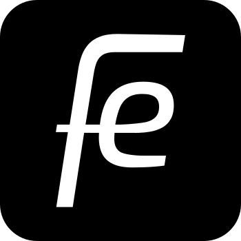

## Fe blog

This is the Fe blog hosted at https://blog.fe-lang.org. It is built with [Zola](https://www.getzola.org/).


## How to write an article

Create a new file in `/content/posts` and send a pull requests.

## How to serve locally

Clone repo `git clone https://github.com/fe-lang/blog.git`

Populate the apollo theme folder, `git submodule init` && `git submodule update`

Run zola `zola serve`

## How to deploy

Run `make deploy`

## Social visuals

Generate tweet-thread cards from editable campaign data:

```sh
make social
```

See [the social tooling guide](tools/social/README.md) for setup, previews,
and creating a new campaign. The [Fe 26.3 thread draft](social/release-26-3/thread-draft.md)
contains the original tweet copy and visual ideas.

## Community

- Twitter: [@official_fe](https://twitter.com/official_fe)
- Chat: [Discord](https://discord.gg/ywpkAXFjZH)
